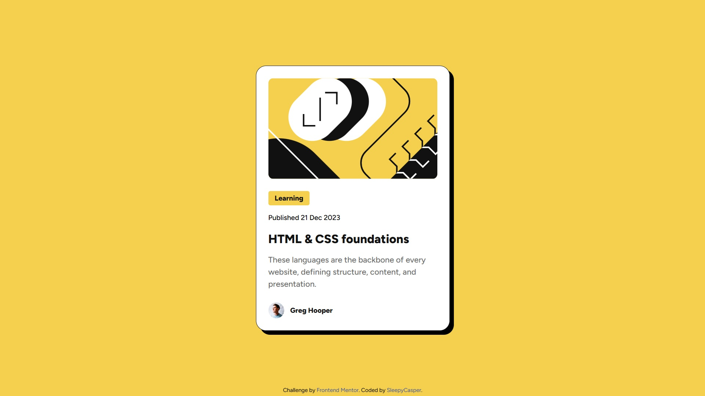

# Frontend Mentor - Blog preview card solution

This is a solution to the [Blog preview card challenge on Frontend Mentor](https://www.frontendmentor.io/challenges/blog-preview-card-ckPaj01IcS). Frontend Mentor challenges help you improve your coding skills by building realistic projects. 

## Table of contents

- [Overview](#overview)
  - [The challenge](#the-challenge)
  - [Screenshot](#screenshot)
  - [Links](#links)
- [My process](#my-process)
  - [Built with](#built-with)
  - [What I learned](#what-i-learned)
  - [Continued development](#continued-development)
  - [Useful resources](#useful-resources)
- [Author](#author)


## Overview

### The challenge

Users should be able to:

- See hover and focus states for all interactive elements on the page

### Screenshot



### Links

- Solution URL: [GitHub](https://github.com/SleepyCasper/FrontendMentor-blog-review-card)
- Live Site URL: [Live preview](https://sleepycasper.github.io/FrontendMentor-blog-review-card/)

## My process

### Built with

- Semantic HTML5 markup
- CSS custom properties
- Flexbox

### What I learned

This project gave me the first experience of working with variable fonts and using pseudo-class ```:hover``` for more advanced styling.

### Continued development

I look forward to learn more about pseudo-classes to improve my CSS skills and make modern, comfortable for use webpages.

### Useful resources

- [Kevin Powell - Getting started with Variable fonts on the web](https://youtu.be/0fVymQ7SZw0) - A video guide that helped me with setting up variable fonts.

## Author

- GitHub - [SleepyCasper](https://github.com/SleepyCasper)
